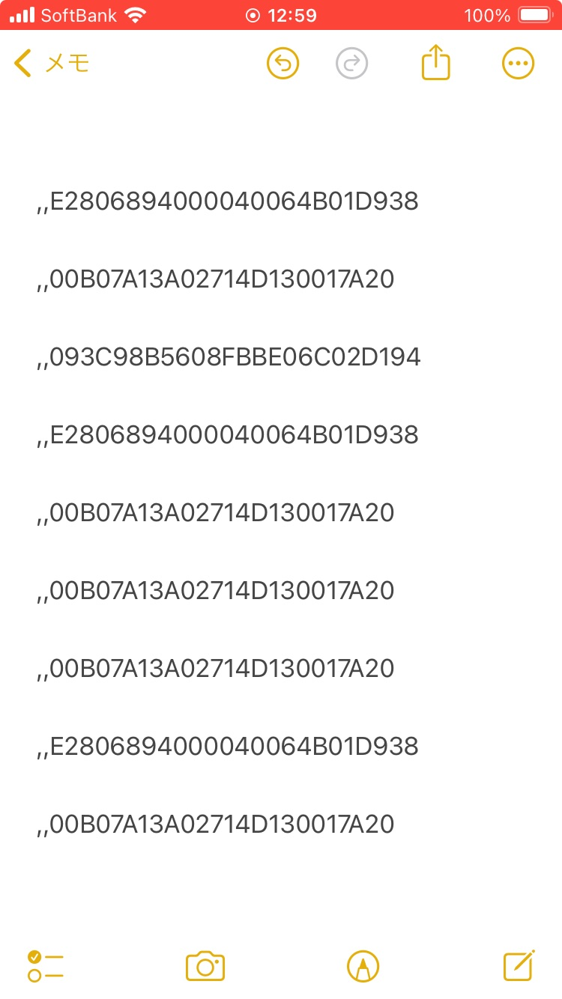

# RFD40, RFD90でHIDモードに設定する方法

 

Zebra RFDシリーズにおいて、HIDで読み取りデータを出力したいというお問い合わせが多いので、まとめサイトを作成。

1. 必要な機器

    - RFD40 or RFD90 リーダー
    - パソコンとRFDを接続するためのUSBケーブル
    - Window 10 以上のパソコン
    - 上記パソコンに123RFIDがインストールされていること

 
 

### HID出力するための設定

1. PCとRFDをUSBケーブルで接続する。

1. 接続方式に合わせて、下記リンクの手順に従って設定をする。

    [HID設定: USB接続場合](https://supportcommunity.zebra.com/s/article/000022170?language=ja)
    [HID設定: Bluetooth接続場合](https://supportcommunity.zebra.com/s/article/000022171?language=ja)

     

1. HID出力可能なアプリに読み取りデータを出力して確認する。

     
    
    例、iPhone SE/ メモ

    

 
 

### 123RFIDがRFDを認識しない場合

Windows PCの言語設定状況によっては123RFIDが正常に動作しない場合がある。その際は下記リンクの手順を参考にすること。

[123RFID デスクトップが USB 接続経由で RFD40 を検出できない](https://supportcommunity.zebra.com/s/article/000021468?language=ja)

[123RFID Desktop利用時にRFリーダが表示されない](https://github.com/shimauma-giken/Zebra-RFID_123RFID-Desktop-do-not-Dicover-Readers)